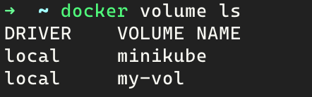
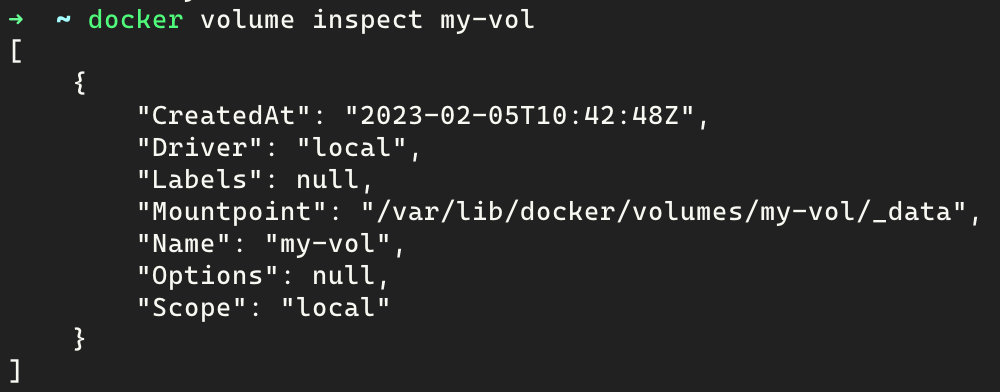
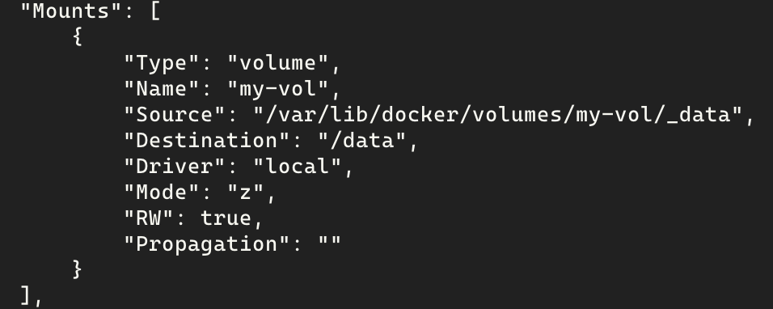
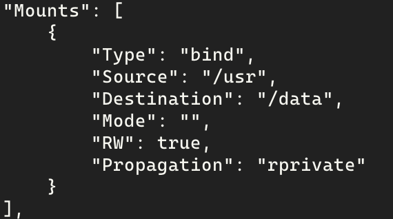
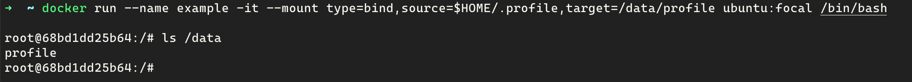

# 2.4 数据共享与持久化

## 数据卷

**数据卷** 是一个可供一个或者多个容器使用的特殊目录，可以绕过UFS（Unix File System），提供更多的特性：

- 数据卷可以在多个容器之间共享和重用
- 对数据卷的修改可以立刻生效
- 对数据卷的更新不会影响到镜像
- 数据卷会独立于容器一直存在


### 创建数据卷

```bash
# 创建一个名称为my-val的数据卷
docker volume create my-vol
```

### 查看数据卷

```bash
# 查看存在的数据卷
docker volume ls
```



```bash
# 查看数据卷的详细信息
docker volume inspect my-vol
```



### 挂载数据卷

需要挂载一个数据卷，可以在启动容器的时候通过使用参数--mount（或者老的参数-v/--volume）来指定将数据卷挂载到容器中的哪个目录，如果挂载目录不存在，docker会自动创建该目录。

```bash
# 使用-v参数挂载数据卷
docker run --rm --name example -it -v my-vol:/data ubuntu:focal /bin/bash

# 使用--mount参数挂载数据卷
docker run --rm --name example -it --mount source=my-vol,target=/data ubuntu:focal /bin/bash

# 也可以显式指定挂载类型为数据卷，type=volume
docker run --rm --name example -it --mount type=volume,source=my-vol,target=/data ubuntu:focal /bin/bash
```

还可以以只读的方式挂载

```bash
# 使用-v参数挂载数据卷
docker run --rm --name example -it -v my-vol:/data:ro ubuntu:focal /bin/bash

# 使用--mount参数挂载数据卷
docker run --rm --name example -it --mount source=my-vol,target=/data,readonly ubuntu:focal /bin/bash
```

挂载成功后，可以通过 **docker inspect** 命令查看容器的详细信息，这里主要关注挂载信息。

```bash
# 查看容器信息，
docker inspece example
```



### 删除数据卷

```bash
# 删除数据卷my-vol
docker volume rm my-vol

# 删除所有数据卷
docker volume prune
```

## 挂载主机目录

可以通过挂载主机目录的方式实现数据持久化，区别于数据卷挂载，这种方式直接用到了宿主机的FS。

```bash
# 使用-v参数挂载主机目录
docker run --rm --name example -it -v /usr:/data ubuntu:focal /bin/bash

# 使用--mount参数挂载主机目录，必须显式指定挂载类型为工作目录，type=bind
docker run --rm --name example -it --mount type=bind,source=/usr,target=/data ubuntu:focal /bin/bash
```

同样，与数据卷挂载一样，也可以以只读的方式挂载，这里不过多赘述。

挂载成功后，同样可以用 **docker inspect** 查看挂载信息。

```bash
# 查看容器信息，
docker inspece example
```



可以看到这里的类型是bind，表示是将主机目录绑定到容器的某个目录下。

除此挂载主机的目录到容器里，还可以只挂载某个文件

```bash
docker run --rm --name example -it --mount type=bind,source=$HOME/.profile,target=/data/profile ubuntu:focal /bin/bash
```


