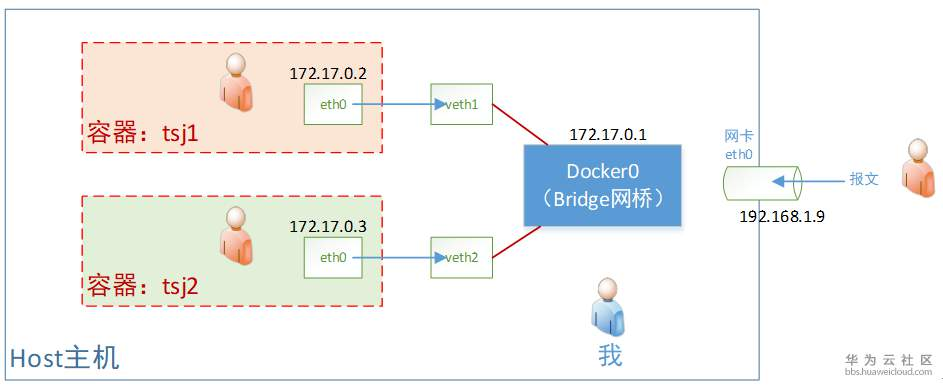
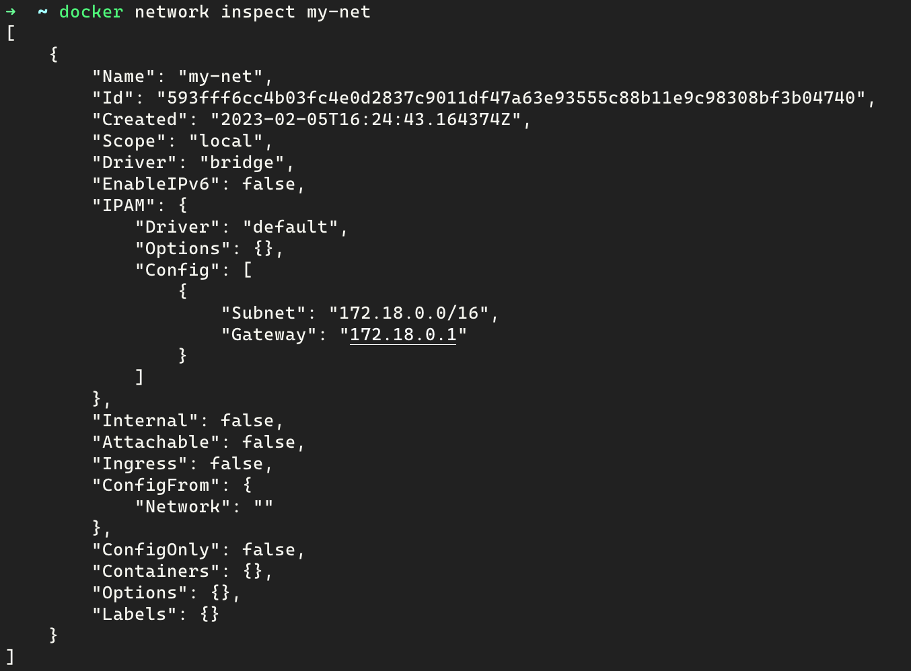
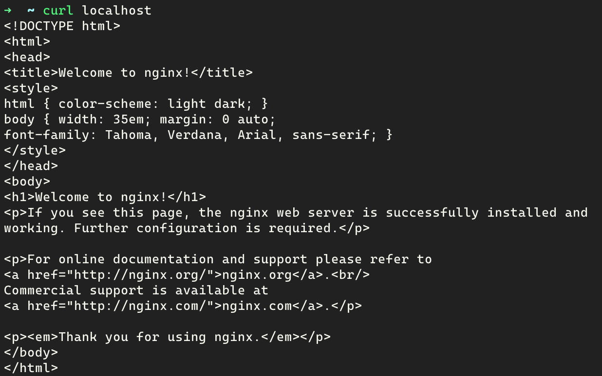
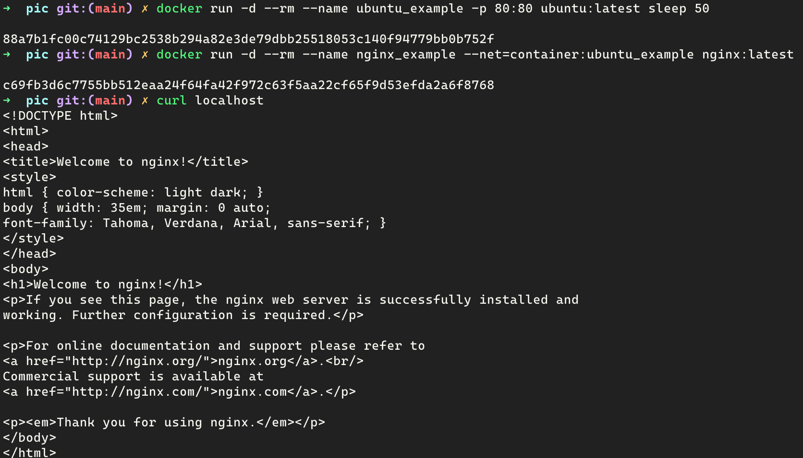
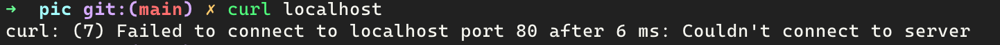

# 2.5 Docker的网络模式

## Bridge模式

当docker服务启动时，会在宿主机上生成一个名为docker0的网卡（负责通信的硬件设备，具有唯一的MAC地址），这个网卡就是虚拟网桥（网桥是数据链路层设备，会根据MAC地址转发数据帧，组成一个二层网络）。该网卡还会分配一个IP地址和子网地址，作为连接到该网桥上的容器的**默认网关**。当一个容器创建的时候，docker会创建一对虚拟网卡 **veth pair**，并将其中一端放在新建的容器中，命名为eth0，并从docker0的子网中分配一个IP给eth0，具有单独Network namespace，不与宿主机共享网络IP、端口范围等。而另一端则放在宿主机上，并以vethxxx的形式命名，并加入到docker0网桥中。这样宿主机上的所有容器就通过该网桥连在了一个二层网络中，与此同时，该网桥作为默认网关还把连接在其上的容器组成了一个三层网络，如下图所示



从图中可以看出，所有通过docker0相连的容器都处于同一个三层网络（子网），因此可以直接通过容器的IP:PORT访问对方的服务，另外，由于docker0也是宿主机上的网卡（虚拟），因此宿主机上的应用也可以直接根据容器中IP:PORT进行访问，只是请求会经过docker0网关。

而容器中的服务是否能访问外部服务呢？实际上在网桥docker0创建的时候，会在宿主机上的iptables里创建一条NAT规则，该规则指示将来自docker0组成的子网网段的包的源IP:PORT做一次NAT（SNAT），替换成宿主机的IP:PORT再发送出去，从而实现访问外部服务的能力。

由于服务是运行在容器内部，绑定的也是容器的端口，因此外部应用无法直接通过宿主机的IP:PORT直接访问容器中的服务，需要进行端口的映射来将宿主机的端口映射至容器的端口，即包中的目标地址（宿主机IP:PORT）转换为容器的IP:PORT，这实际上又是一次NAT（DNAT），这条映射规则也存储在宿主机的iptables里。

使用 **docker run -p** 命令进行端口映射实际上就是在iptables里新建了DNAT规则，实现了端口映射，使得外部应用可以通过宿主机的地址访问到容器内的服务。

bridge模式是docker的默认网络模式，上面介绍的就是bridge模式的原理

```bash
# 默认为bridge模式
docker run -d --rm --name example -p 80:80 nginx:latest

# 显式指定为bridge模式
docker run -d --rm --name example --net=bridge -p 80:80 nginx:latest
```

除了使用默认的docker0网桥，还可以使用自己创建的网桥

```bash
# 创建一个名为my-net的网桥
docker network create -d bridge my-net
```

查看该网桥的子网和IP（容器网关地址）

```bash
# 查看网桥信息
docker network inspect my-net
```



将创建的容器接入到该网桥

```bash
# 新建的容器接入到my-net网桥
docker run -d --rm --name example -p 80:80 --network my-net nginx:latest
```

## Host模式

启动容器时指定网络为Host模式，那么新建的容器将不会创建自己的Network namespace，而是和宿主机共享一个Network namespace，因此宿主机不会（也不需要）虚拟出自己的网卡，而是使用宿主机的网卡，并共享IP和端口范围。因此，使用这种网络模式的容器无需进行端口映射，直接可以通过宿主机的IP:PORT来访问容器中的服务。

```bash
# 以Host模式运行容器，可直接访问nginx服务，无需端口映射
docker run -d --rm --name example --net=host nginx:latest
```



## Container模式

使用这种模式创建的容器，需要指定一个现有的容器，并于该容器共享Network namespace，此时新建的容器和指定的容器共享虚拟网卡、IP和端口范围。

```bash
# 以Bridge模式创建一个容器，并对80端口做映射到宿主机的80端口，后台运行50s
docker run -d --rm --name ubuntu_example -p 80:80 ubuntu:latest sleep 50

# 以Container模式创建一个容器，与ubuntu_example共享网络，由于80端口已暴露，可以直接访问
docker run -d --rm --name nginx_example --net=container:ubuntu_example nginx:latest
```

ubuntu_example还在运行中，所以可以直接访问nginx服务



ubuntu_example停止运行，nginx没有自己的网络，访问失败



## None模式

这种模式创建的容器会有自己的Network namespace，但并不会生成虚拟网卡，也就没有网络配置，需要用户自己在容器中添加虚拟网卡，网络配置。

```bash
docker run -d --rm --name example --net=none nginx:latest
```

进入容器发现，除了localhost能够访问之外，访问外部网络全部失败，因为该容器没有网卡。
