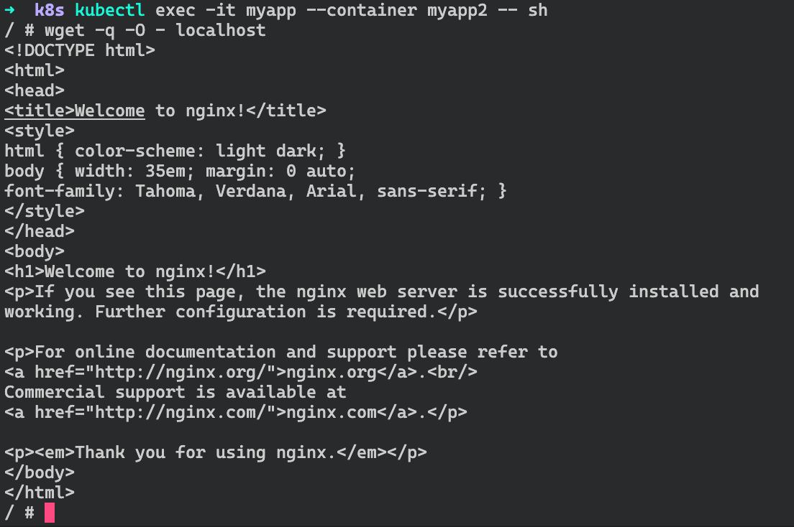
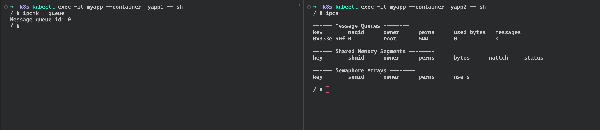
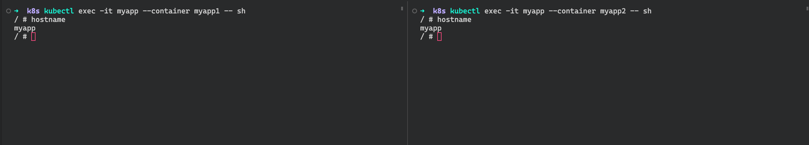
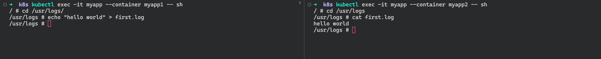

# Kubenertes 初体验

一个Pod可以有多个Container，这些容器可以共享一部分资源：

- PID命名空间：Pod中不同的应用程序可以看到其他应用程序的进程ID

```yaml
# 默认不共享进程命名空间，需要将shareProcessNamespace设置为true
apiVersion: v1
kind: Pod
metadata:
  name: myapp
  labels:
    name: myapp
spec:
  shareProcessNamespace: true # 共享进行命名空间，PID可以相互查看
  containers:
    - name: myapp1
      image: busybox:1.30.1
      command:
        - "sleep"
        - "1000"
      resources:
        limits:
          memory: "128Mi"
          cpu: "500m"
    - name: myapp2
      image: busybox:1.31.1
      command:
        - "sleep"
        - "1000"
      resources:
        limits:
          memory: "128Mi"
          cpu: "500m"
```

可以查看对方的进程信息


- 网络命名空间：Pod中的多个容器能够访问同一个IP和端口范围，通过共享一个名为pause的容器的网络命名空间来实现

```yaml
# k8s默认实现了同一个pod内容器的网络命名空间的共享
apiVersion: v1
kind: Pod
metadata:
  name: myapp
  labels:
    name: myapp
spec:
  containers:
    - name: myapp1
      image: nginx:latest
      resources:
        limits:
          memory: "128Mi"
          cpu: "500m"
    - name: myapp2
      image: alpine:latest
      command:
        - "sleep"
        - "1000"
      resources:
        limits:
          memory: "128Mi"
          cpu: "500m"
```

容器可以直接通过localhost请求另一个容器的服务



- IPC命名空间：Pod中的多个容器能够使用SystemV IPC或POSIX消息队列进行通信

```yaml
apiVersion: v1
kind: Pod
metadata:
  name: myapp
  labels:
    name: myapp
spec:
  containers:
    - name: myapp1
      image: mangydog/alpine:utils
      command:
        - "sleep"
        - "1000"
      resources:
        limits:
          memory: "128Mi"
          cpu: "500m"
    - name: myapp2
      image: mangydog/alpine:utils
      command:
        - "sleep"
        - "1000"
      resources:
        limits:
          memory: "128Mi"
          cpu: "500m"
```

使用ipcmk --queue创建一个队列，另一个容器可以看到创建的队列



- UTS命名空间：Pod中的多个容器共享一个主机名

```yaml
apiVersion: v1
kind: Pod
metadata:
  name: myapp
  labels:
    name: myapp
spec:
  containers:
    - name: myapp1
      image: alpine:latest
      command:
        - "sleep"
        - "1000"
      resources:
        limits:
          memory: "128Mi"
          cpu: "500m"
    - name: myapp2
      image: alpine:latest
      command:
        - "sleep"
        - "1000"
      resources:
        limits:
          memory: "128Mi"
          cpu: "500m"
```

两个容器可以查询到相同的主机名



- Volumes（共享存储卷）：Pod中的各个容器可以访问在Pod级别定义的Volumes

```yaml
apiVersion: v1
kind: Pod
metadata:
  name: myapp
  labels:
    name: myapp
spec:
  containers:
    - name: myapp1
      image: alpine:latest
      command:
        - "sleep"
        - "1000"
      volumeMounts:
        - mountPath: /usr/logs
          name: logs
      resources:
        limits:
          memory: "128Mi"
          cpu: "500m"
    - name: myapp2
      image: alpine:latest
      command:
        - "sleep"
        - "1000"
      volumeMounts:
        - mountPath: /usr/logs
          name: logs
      resources:
        limits:
          memory: "128Mi"
          cpu: "500m"
  volumes:
    - name: logs
      emptyDir: {}
```

在容器中创建的文件可以在另一个容器中看见


