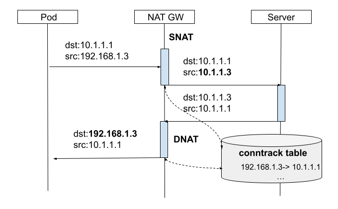
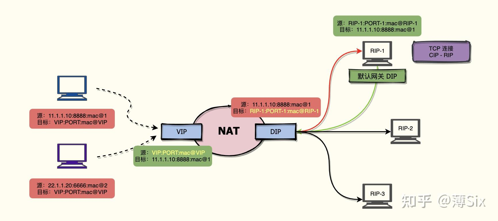
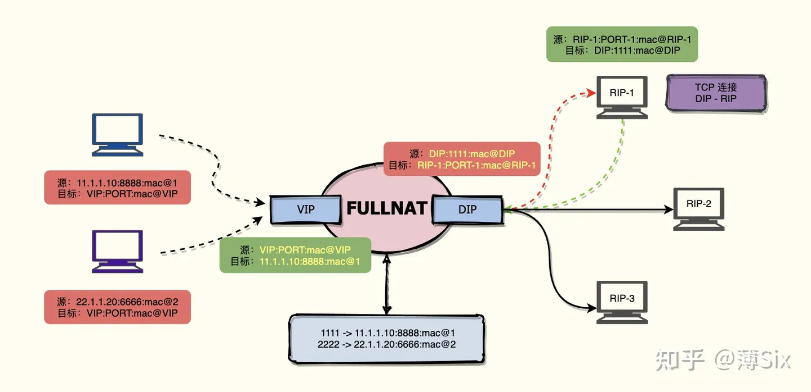

# NAT

> NAT（Network Address Translation）网络地址转换，用于内网（局域网）IP到公网（互联网）IP之间的转换，主要解决的IPv4时代地址短缺的问题，同时还可以提供内网隔离的网络环境，保证内网的安全性。另外，在四层负载均衡中也常使用NAT技术

## NAT类型

- SNAT（source NAT）

SNAT通常应用于内网环境内的主机需要访问公网服务的情况，此时需要将四元组中的（源IP，源Port）转换为默认网关的（出口IP，出口Port），如果不进行这个转换，由于主机处于内网环境中，响应（ack）的（目的IP，目的Port）将无法路由到内网机器，导致网络访问失败。

默认网关（路由器）通常都会执行SNAT，这样网关内（子网）的主机都可以进行公网访问。通常来说，默认网关的出口IP也处于某个子网内部，也就是说网关也是某个子网的主机，是一种子网级联的拓扑结构，对外访问还需要对再继续做SNAT，直到到达出口IP为公网的网关为止。

SNAT扩展了IP地址，由于只要求有一个公网IP，这样本来只能使用一个公网IP对外进行访问变成内部所有的内网IP都能对外访问。这种当然也不是没有限制，由于端口号数量的限制（65536），内网中机器理论上能够同时创建最多65536个连接（TCP/UDP），之所以说是理论上，因为0-1023为保留端口号，通常不用于动态分配。

- DNAT（destination NAT）

DNAT主要用在反向代理和四层负载均衡的情况，对内部服务进行屏蔽，并对请求进行负载均衡。和SNAT相反，DNAT会将四元组中的（目的IP，目的Port）转换为后端真实服务器的（目的IP，目的Port）。例如，k8s中service的cluster IP到pod IP就经历了一次DNAT。docker中的端口暴露也使用了DNAT：主机地址到pod地址的转换。

- FULLNAT

SNAT和DNAT只是在请求的时候对源地址和目标地址进行了转换，那么响应有没有做转换呢？答案是做了转换。当执行NAT的主机会将转换记录到连接跟踪表（conntrack）中，当响应返回时，会查询连接跟踪表，并执行相反的NAT操作。

例如，网关对内网请求执行了SNAT，修改了源地址，那么当响应返回时，网关会执行DNAT修改目标地址，这一来一回的NAT操作形成了一个回路，这个回路执行了SNAT和DNAT，不过方向不同而已，一个是对请求做SNAT，一个是对响应做DNAT。

如果在一个方向同时执行了SNAT和DNAT，那么这个就叫做FULLNAT，和DNAT一样，FULLNAT常用于反向代理和四层负载均衡。

## 四层负载均衡使用的NAT

四层负载均衡通常使用NAT来实现，上面提到的DNAT和FULLNAT就是做这个活的。

DNAT：

***要求后端服务器的默认网关一定是LB***，此时会将四元组中的目标地址转换为后端真实服务器的地址，由于LB是默认网关，请求一定会原路返回，LB会查询连接跟踪表来执行SNAT

FULLNAT：

使用DNAT的缺点在于LB要作为后端服务的默认网关，也就是说LB和后端服务器一定要处于同一局域网内。但是在很多场景下，要求后端服务在不同的地域来实现物理容灾，这种情况DNAT就不再适用了，如果继续使用DNAT，由于后端服务的默认网关不一定是LB，响应可以经过其他路径返回到客户端，客户端收到响应后发现响应的源地址和发出数据包的目标地址不一致，将会丢弃这个响应。

实现负载均衡的关键就是对请求和响应做相反的NAT操作，***这要求请求和响应都经过LB***（DNAT通过默认网关来保证这一点），而对于后端真实服务器不在一个局域网内的情况，可以对请求也执行SNAT来保证响应也经过LB。这其实就是FULLNAT的做法，LB对请求的四元组同时做DNAT和SNAT，DNAT可以保证请求可以转发到后端真实服务器，SNAT使得响应返回时目的地址为LB，保证了响应一定会途径LB。在经过LB后，再根据连接跟踪表执行SNAT+DNAT，就能保证响应正确返回到客户端。

