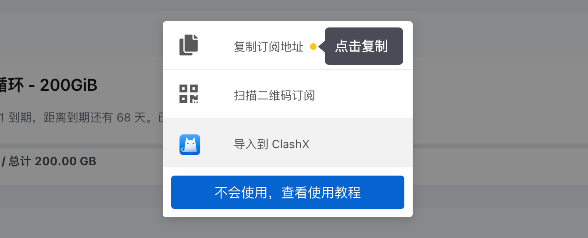
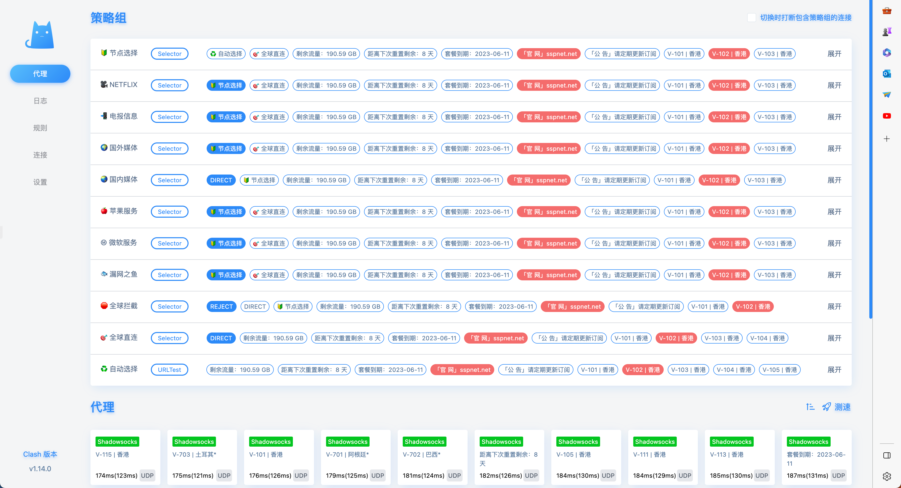

# Linux下Clash安装配置指北

在缺少GUI的情况下，纯命令行中安装运行clash

## Prerequisites

- curl
- gzip

## 安装

```bash
# 在HOME目录创建一个clash的文件夹
mkdir $HOME/clash && cd $HOME/clash
```

```bash
# 下载二进制clash服务端程序至本地
curl -Lf https://github.com/Dreamacro/clash/releases/download/v1.14.0/clash-linux-amd64-v1.14.0.gz -o clash.gz
```

```bash
# 解压并赋予执行权限
gzip -d clash.gz && chmod u+x clash
```

## 运行

获取订阅地址，以少数派为例


```bash
# 获取可用节点
curl -H 'User-agent: Clash' {subscription} -o config.yaml
```

其中**subscription**为上面复制的订阅地址

获取可用节点后，修改配置文件config.yaml中的external-controller（详情查看[api文档](https://clash.gitbook.io/doc/restful-api)），以便后续可以通过web访问clash的api

```yaml
# 监听主机所有的网卡
external-controller: '0.0.0.0:9090'
# 配置登陆密码，可选但推荐
secret: xxx
```

```bash
# 后台启动clash
nohup ./clash -d . &
```

## 节点管理

可以登陆[clash web管理页面](http://clash.razord.top/#/proxies)管理/查看节点，需要依次输入服务器的地址，端口号（上面配置的external-controller的端口号）以及密码（上面的secret），点击保存，登陆。


登陆成功后即可看到订阅的节点



## 连接代理

上面成功配置和运行clash后，如何将流量打到clash呢？在linux下，可以通过配置环境变量all_porxy将所有流量都代理到clash，或者配置http_proxy和https_proxy，只代理http的流量。可以在HOME下创建一个.proxy文件，并将环境变量写入（默认代理所有流量）

```bash
touch $HOME/.proxy && cat << EOF > $HOME/.proxy
export all_proxy=http://{address}:7890
# export http_proxy=http://{address}:7890
# export https_proxy=http://{address}:7890
EOF
```

其中**address**替换为通过ifconfig查询到的etho0的ip地址，可能会和服务ip地址不相同，以ifconfig查询到的ip为准。

创建.proxy文件之后，后续只需要加载这个文件即可生效代理

```bash
source $HOME/.proxy
```

## 验证

请求google官网，能访问即配置成功
```bash
curl www.google.com
```
